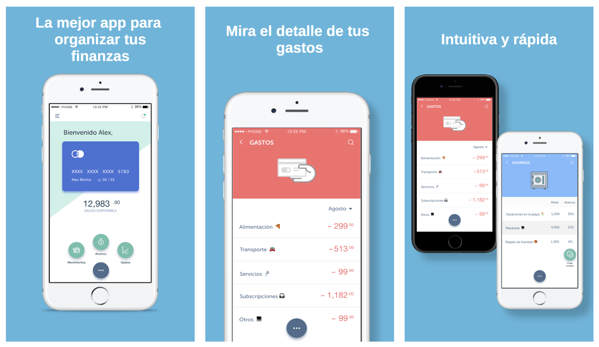
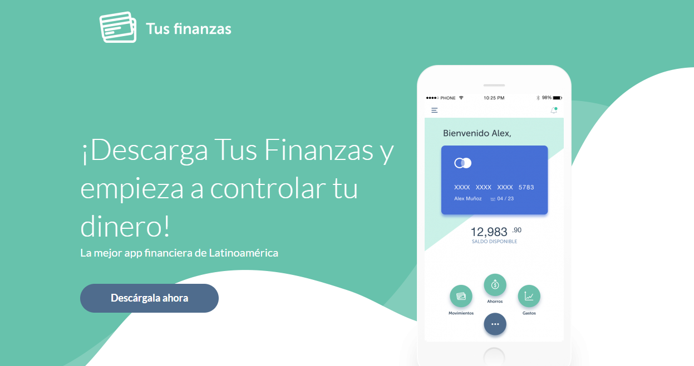
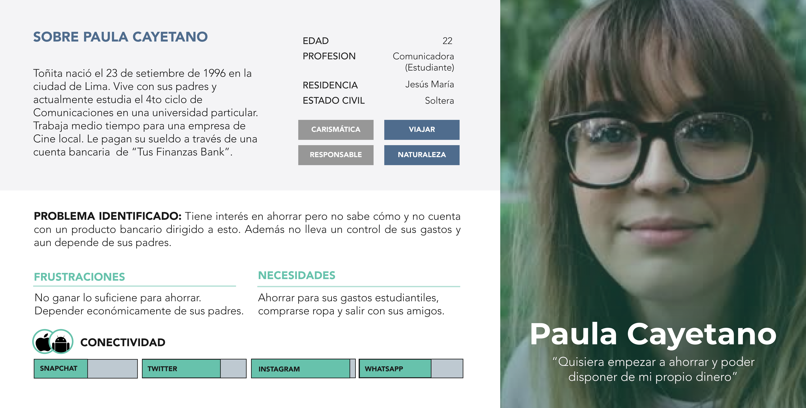
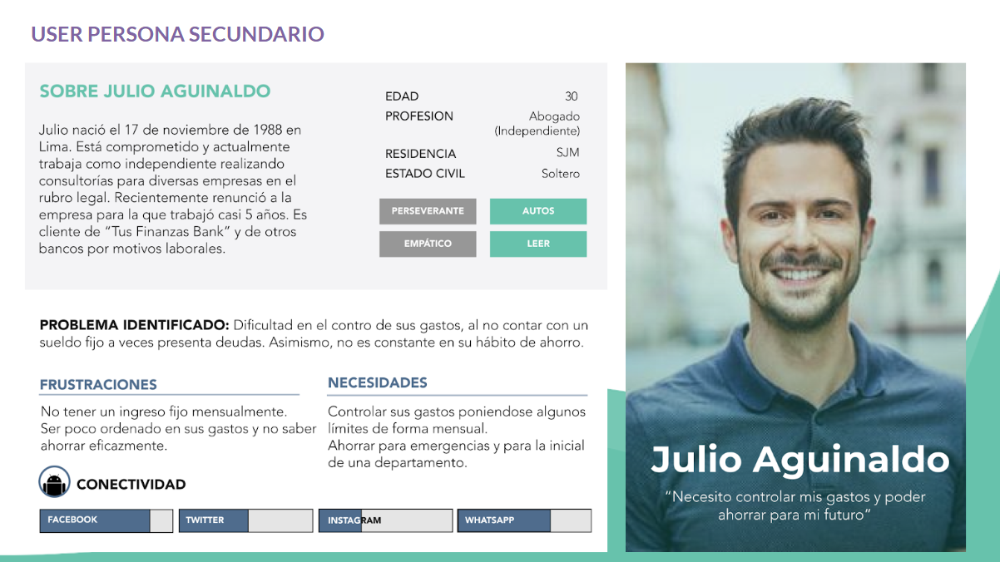
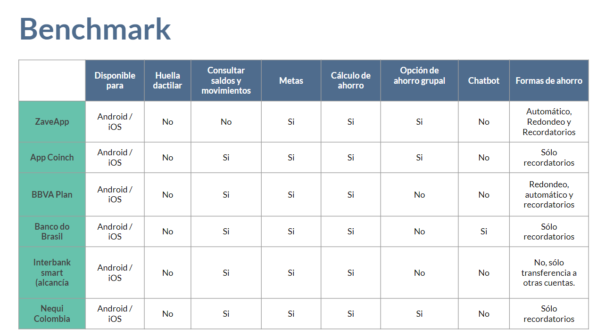
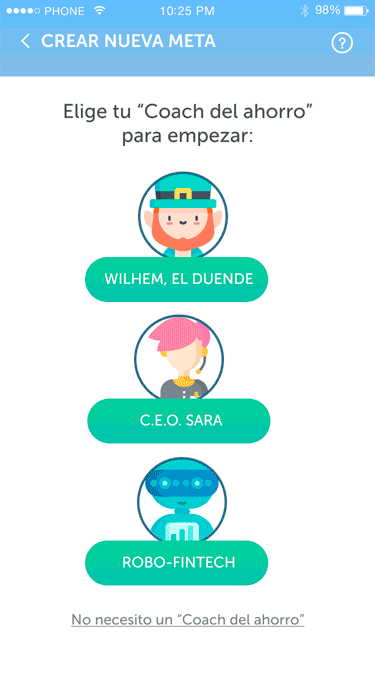
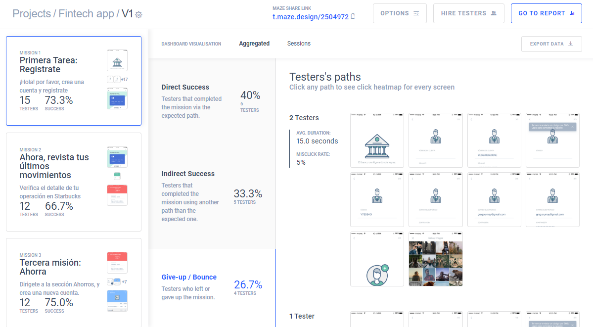
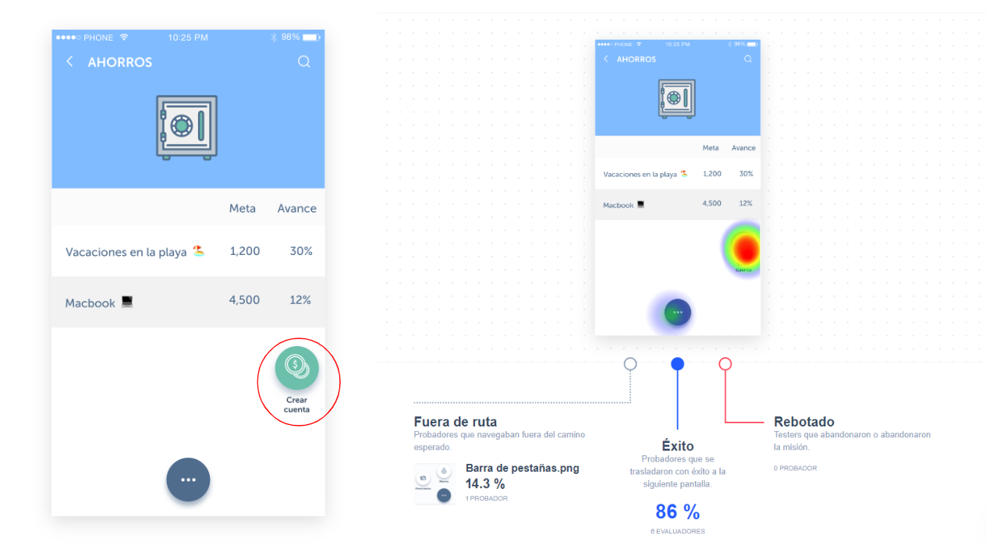
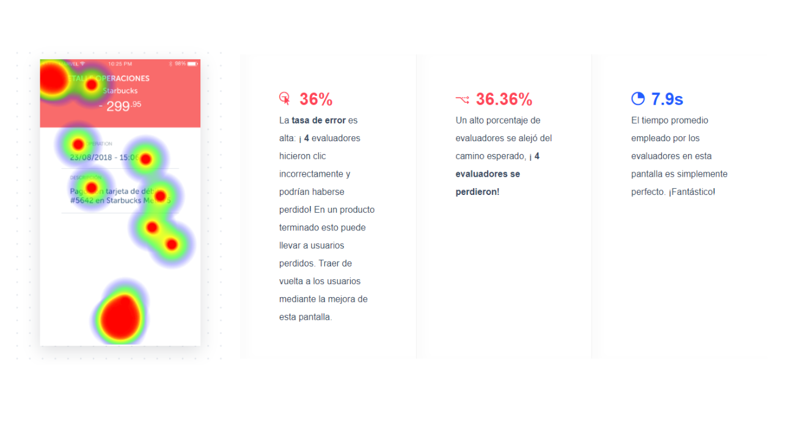

# Aplicación financiera

## Índice

* [Introducción](#introducción)
* [Contexto](#contexto)
* [Objetivos del proyecto](#objetivos-del-proyecto)
* [Investigación](#investigación)
* [Síntesis y definición](#síntesis-y-definición)
* [Ideación](#ideación)
* [Prototipado](#prototipado)
* [Testing](#testing)
* [Recomendaciones](#recomendaciones)
* [Documentación](#documentación)

## Desafío

El banco más importante del país ha lanzado una nueva aplicación móvil al mercado para que sus usuarios puedan visualizar sus gastos mensuales y fomentar el ahorro. Luego de tener algunos meses en el mercado y algo de tracción, el equipo detrás de este nuevo producto ha decidido contratar a una agencia/consultora de UX que los ayude a definir la dirección y evolución del producto. Tú y otra compañera de Laboratoria trabajan en la agencia/consultora de UX y son asignadas al proyecto.

## Introducción

"Tus finanzas" es una aplicación móvil que permite a sus usuarios y usuarias tener un mejor control de su dinero y fomenta el hábito del ahorro, a través de funciones como: Mirar en detalle de sus transacciones (dónde y qué se gastó), crear metas de ahorros y administrar sus gastos (mirar gastos por categorías). Fue lanzada al mercado de forma independiente a la aplicación genérica del banco pero mantiene la conexión con esta para permitir a los usuarios y usuarias de la entidad acceder a la información de sus cuentas y créditos de forma fácil y rápida. 

Durante los 6 meses de vida de la aplicación, su principal fuente de publicidad ha sido Facebook Ads, observándose una buena respuesta por parte del público. Esto a pesar que uno de los obstáculos principales de la aplicación es que solo se encuentra disponible para el sistema operatido iOS, limitando de esta forma su alcance por la cantidad de usuarios de otros sistemas operativos como Android, que en Latinoamérica tiene una presencia más que importante. 

"Tus finanzas", busca convertirse en la primera aplicación bancaria en incluir estas características propias de aplicaciones no conectadas a una institución financiera o similar, para esto la empresa requiere tener mejor definidos a sus usuarios o usuarias, un adecuado user flow e integrar mejoras que respondan a las necesidades reportadas por estos usuarios.

## Contexto

El papel del desarrollo tecnológico en la industria financiera ya es un imperativo, una necesidad casi inherente de las entidades bancarias. En la actualidad es impensable contratar un servicio o producto bancario sin tener a disposición la opción de realizar transacciones o consultas a través de una banca celular, página web o aplicativo móvil. El proceso de transformación tecnológica e innovación digital de servicios financieros ha estado liderado por EEUU y Europa. En el 2018 el banco BBVA (España) fue reconocido por segundo año consecutivo como la entidad con la mejor aplicación móvil de banca a nivel mundial,  por encima de Garanti (Turquía) y de un total de 42 bancos de 11 países (Forrester, 2018). 

A nivel de Latinoamérica, países como Brasil, México y Argentina constituyen los principales mercados que cuentan con aplicaciones de un alcance importante entre sus usuarios. En el año 2014, Technisys y la Universidad de Stanford realizaron un estudio en América Latina  donde el 90% de los bancos indicó que la razón por la que alcanzaron su capacidad digital fue para continuar siendo competitivos y adquirir clientes jóvenes; por otro lado, en pensando en los próximos 5 años, el 72% refirió que piensa que sus clientes no requerirán tener que ir personalmente a las sucursales.

Con respecto a la conducta de ahorro, control de gastos y otros hábitos gestión financiera, un estudio de Mercawise a nivel de México determinó que el 45% de los encuestados ahorra a través de una entidad bancaria; además, indicó que solo un 8.5% conocía planes de ahorro, mientras que a un 47.5% le gustaría comenzar un plan de ahorro con alguna compañía que se acople a tus necesidades. 

En el Perú, según el Departamento de Estudios Económicos de Scotiabank, el ahorro de las personas continuó en aumento durante los primeros meses del 2018, pasando a un ritmo de 10% a 14% en comparación del 2017; lo que indica una tendencia al crecimiento de esta conducta y que puede explicarse a causa de la Ley 95,5%, que permitió a las personas que acceden a la jubilación, disponer de hasta el 95.5% de sus fondos de pensiones. En este mismo estudio, se extrae que las personas mantuvieron su preferencia por ahorrar en moneda nacional.

De esta manera, teniendo en cuenta el crecimiento de las prácticas de ahorro y la transformación digital del rubro financiero, existe una gran oportunidad para introducir productos digitales prestos a atender necesidades financieras y potenciar las soluciones de banca ya existentes.

### Recursos
Recursos entregados por nuestros clientes:

* User persona primario y secundario del proyecto
* User flows iniciales y actuales del proyecto del MVP
* Diseño del app en Figma , con una guía de componentes y el Prototipo navegable
* Funnel Analytics de los primeros 6 meses del MVP
* Data de uso del MVP de los primeros 6 meses
* Landing Page inicial del producto

### MVP inicial

### Landing Page incial del producto

Ir a la web de [Tus finanzas](http://tus-finanzas.pagedemo.co/).

### Presupuesto

|Actividad|Descripción|Puntos|
|:----|:---|:---:|
|Entendimiento del problema, la industria y el contexto| Entender el contexto del negocio y lo que existe hoy en día respecto de la industria del proyecto. | 15 |
|Entrevistas con cliente|Realización de entrevistas con el cliente (dueño del reto) y establecimiento de sus metas y objetivos.|25|
|Benchmark| Revisión de features de la competencia y referencias análogas. | 20 |
|Entrevistas con usuarios| Entrevistas en profundidad con al menos 5 usuarios. | 60 |
|Testeos de prototipos| Sesiones de testing de la solución propuesta (baja, media y alta fidelidad) con al menos 5 usuarios por sesión. | 60 |
|Prototipado de alta fidelidad| Elaboración de prototipo en base a las pantallas diseñadas. | 80 |
|| **TOTAL** | **290** |

## Objetivos del proyecto
* Realizar una propuesta de rediseño de app con un flujo centrado en el usuario.

* Brindar recomendaciones de presupuesto y pasos a seguir para el desarrollo de las soluciones ideales.

* Identificar, entender y validar los objetivos de negocio y stakeholders de la empresa y considerarlo en las etapas del desarrollo del producto.

* Profundizar nuestra capacidad de análisis de data.

## Investigación 

### Objetivo de negocio
- Posicionarse como un banco que brinde una herramienta adicional dirigida a fomentar la conducta de ahorro en sus clientes, ayudándoles a llevar un control de sus gastos.

### Conclusiones de la entrevista con cliente

Lee la [guía de entrevista al cliente](docs/Client.docx)

1. Interés en trabajar a partir de un equipo ágil, en el desarrollo de un producto fuera de los productos tradicionales que genere un valor agregado a lo ya esperado en un app de banco.
2. El problema que desean resolver o la necesidad que desean abordar tiene que ver con la generacion de metas de ahorro que permitan a los clientes  generar una cultura de ahorro.
3. El objetivo del banco es adquirir más clientes que les confíen su dinero.
4. Esta app permite a los usuarios obtener información de sus gastos de una forma automática, sin necesidad de ingresar los montos manualmente al estar conectado a una cuenta del banco.
5. Existen dudas con respecto al impacto del presupuesto asignado a publicidad en Facebook, en vista que no se han logrado las conversiones esperadas a nivel de usuarios registrados que estén usando la app. 
6. Esperan que la investigación arroje luces sobre qué decisiones tomar con respecto a la inversión en publicidad y si los usuarios definidos son realmente representativos.
7. De la presente iteración esperan generar mayor presencia de usuarios utilizando la app.
8. La razón por la cual se lanza el producto al mercado en el sistema iOS es porque en el equipo que desarrolló el MVP contaban con un desarrollador en este sistema operativo y decidieron aprovechar este recurso.
9. Desarrollar para android está dentro de los planes a corto plazo y es una alternativa que desearían explorar, teniendo en cuenta el proceso de investigación que se realice en esta iteración.
10. Desean entender cómo mejorar o llevar a un siguiente nivel el producto, así como entender un poco mejor qué ocurrió con la aplicación en su primer lanzamiento.

### Conclusiones de la entrevista con usuarios

Lee la [guía de entrevista a usuario](docs/User.docx)

1. Los usuarios que no cuentan con una cultura de ahorro indican que es debido a: no contar con ingresos económicos suficientes y la falta de una motivación o ayuda externa.
2. Para los usuarios que si suelen ahorrar, la dificultad principal reside en los gastos imprevisto y las metas poco claras o consistentes.
3. Las formas de ahorro más comunes tienen que ver con herramientas o personas externas que ayudan a mantener el dinero ahorrado a salvo de gastos no contemplados.
4. El ahorro en grupo y por medio de juntas no son considerados alternativas confiables.
5. Los usuarios valoran las medidas de seguridad como lector de huella dactilar y envio de códigos de token a través de mensajes de texto en vista que ofrecen seguridad y rapidez en la transacción.
6. Existe una marcada preferencia por el uso de canales de atención relacionados con tecnología debido a la accesibilidad, inmediatez y facilidad en su uso.
7. Las operaciones más comunes realizadas en apps de bancos son: pagos de servicios y consulta de movimiento o saldo.
8. Los usuarios con experiencia en uso de aplicaciones para ahorro o control de gastos refieren haber tenido dificultades en el manejo de las mismas por la gran cantidad de opciones y poca claridad de funcionalidades.
9. Con respecto a la gestión de gastos, los usuarios manifestaron la necesidad de organizarlos por prioridad, no ejerciendo un control excesivo de los mismos dando pie a que puedan destinar un monto al ahorro.

## Síntesis y definición

### Affinity Map

**Principales quotes del cliente**
- Una aplicación de banco ya se volvió un comodity.
- Buscamos algo que les ayude a ellos a establecer metas y nos ayude mantener el dinero para poder invertirlo y obtener ganacias.
- La aplicación queremos que se enfoque a que ayude al cliente a ahorrar o crear esta cultura de ahorro si quiere hacerlo.
- La aplicación genérica del banco permite ver estados de cuenta, pago de servicios o tarjetas, acceder a todos los servicios que tienes en físico, todas las funciones que te permite hacer cualquier otra app de banco.
- No tenemos una aplicación especifica en mente porque lo que intentamos es ver que hay en el mercado como para ver qué idea interesante podríamos replicar en nuestro contexto.
- El plus de esta (aplicación) sería que está relacionada directamente con tu cuenta del banco.
- Decidimos aprovechar que la mayoría de dispositivos iOS vienen con el tema de la huella y vimos que en ciertas aplicaciones te permite desbloquear con la huella y decidimos aprovechar esto.

**Principales quotes de la entrevista con usuarios**
- Me transmite seguridad porque me pide varios permisos, DNI, código de usuario, y cada vez que hago una operación me envían el token digital que varía por operación que realicé.
- El canal de atención que más uso es la app del banco porque me da muchas facilidades.
- También ahorraba manteniendo el dinero en la tarjeta, al no tener efectivo, no gastaba.
- Me pongo una meta, pero no siempre termino ahorrando lo que me propuse al inicio.
- No hacer gastos innecesarios, hacer un planeamiento mensual que me permita gastar solo lo necesario y lo demás ahorrarlo.
- No me inspira confianza los ahorros grupales porque no conoces bien a la otra persona, o te pueden hacer quedar mal.
- Desinstalé el app de ahorro porque tenía demasiadas opciones, habían cosas que eran innecesarias.
- Me gusta la aplicación porque me ahorra muchísimo tiempo, es muy fluida y la seguridad que me transmite.
- Tendría que tener una motivación, una meta que me incentive ahorrar.

**Conclusiones del Affinity Map**
Los principales grupos de ideas que pudimos extraer de este ejercicio tienen que ver con los siguientes puntos:
1. La necesidad de ahorrar o establecer un hábito de ahorro dirigido a metas, constante y apoyado por un elemento externo que impida incurrir en gastos innecesarios.
2. La importancia de contar con una aplicación que brinde seguridad, pero que también sea fácil de usar, sencilla e interactiva.
3. La posibilidad de realizar una gestión de gastos que permita el ahorro.
4. Tener una aplicación que integre la mayor cantidad de funciones de forma entendible y funcional, que permita la gestión de las finanzas desde una misma plataforma.
5. Poder ofrecer opciones que se ajusten a las necesidades de quienes ya tienen el hábito del ahorro y quieren mejorar, y para quienes estan iniciando recién en la cultura del ahorro.
6. Encontrar una app que funcione como un amigo o amiga que te motiva a ahorrar, te recuerda tus metas y te felicita por tus logros.

Mira nuestro [Affinity Map online](https://realtimeboard.com/app/board/o9J_kyWxqYQ=/)

### User Persona

De la investigación realizada pudimos extraer que los User Persona brindados por el cliente no eran representativos, validando una de nuestras hipósis acerca del poco impacto de la publicidad en Facebook a causa de una errónea segmentación basada en estos User Persona. Nuestra propuesta para los nuevos User Persona se presenta a continuación:

### Customer Journey Map

En base a los recursos brindados y con ayuda del Customer Journey Map, realizamos el análisis e indetificamos los siguientes problemas:

- La segmentación del público objetivo según los User Persona iniciales es errónea. 
- El no segmentar correctamente al público objetivo se traduce en menos visitas a la Landing Page y, por ende, menos conversiones.
- La Landing Page no indica disponibilidad para sistemas operativos  y no muestra suficiente información de valor y confianza para el usuario.
- La aplicación es poco intuitiva en lo siguientes puntos de contacto: Creación de metas de ahorro, Cierre de sesión.

## Ideación 

### Problem Statements
* Paula Cayetano necesita una manera rápida y segura de ingresar a la app financiera sin que le pidan sus credenciales cada vez que quiere revisar sus cuentas.

* Paula Cayetano necesita recibir recordatorios o notificaciones de su app cuando esté sobrepasando sus gastos, cuando haya alcanzado un hito en su meta de ahorro.

* Paula Cayetano necesita desarrollar el hábito de ahorrar teniendo opciones que se ajusten a la cantidad de dinero que gana y metas pequeñas o a corto plazo.

* Paula Cayetano necesita acceder a un producto bancario que le permita guardar sus ahorros y separarlos del resto de dinero del cual dispone.

* Paula Cayetano necesita comunicarse con su banco para resolver dudas sin tener que realizar una llamada o visitar las oficinas de forma física.

* Rodrigo Vera necesita recibir notificaciones de sus fechas de depósito a su cuenta ahorro, para autorizar el débito del monto programado.

### Benchmark 

### HMW

* HMW generar en nuestros usuarios una sensación de seguridad al realizar operaciones en la aplicación?

### What if 

* What if los clientes pueden utilizar la app para gestionar sus ahorros independientemente del banco al que pertenezcan.

* What if Tus finanzas está integrada en la app nativa del banco.

* What if integramos un chatbot en la aplicación.

* What if la aplicación también está disponible para Android.

* What if integramos límites de gastos en la aplicación.

* What if cada vez que el usuario cumple un hito de ahorro, recibe una felicitación en su app que le indica que sube de nivel y gana una categoría.

* What if lo hacemos como un juego?

* What if si existen couch de ahorro personalizados o por temáticas (ejemplo: star wars, pokemon, avengers, etc.)

* What if le brindamos a nuestros usuarios la posibilidad de elegir un avatar y un nickname.

* What if si para ingresar a la app solo basta con la identificación por huella o patrón de seguridad.

## Prototipado

Ver Prototipo en [Marvel](https://marvelapp.com/42c0aa7/screen/54332343)  
Ver [User Flow](images/FlowMap.png)

Vista previa de vistas (Flujo Creación de Meta de Ahorro):

## Testing

### Testing del prototipo inicial: 
Decidimos testear el prototipo actual con una cantidad de 15 usuarios con el fin de obtener los primeros problemas, conocer cómo interactuan con las distintas funcionalidades que ofrece la app. Para este fin utilizamos como herramienta Maze.

Propusimos que desarrollen las funciones principales a través de tareas y encontramos los siguientes resultados:

### Conclusiones principales del primer testing al producto inicial:

* Notamos que existe confusión en la vista de ahorros, realizar una meta de ahorro está escrito como “Crear cuenta”.
* Proceso largo para registrarse. 4 de las personas testeadas desertaron en el proceso de registro.
* Usuarios no encuentran opción de volver al home cuando están en otra sección como ahorros, movimientos o gastos.
* Los usuarios pierden el menú circular flotante al momento de realizar scroll en la app.
* Huella digital: Los usuarios testeados en Android, indican que su celular no cuenta con esa opción.
* Movimientos: los usuarios no observan el origen de la operación, comprenden detalles pero sienten la información desordenada e incompleta.
* No se cuenta con la opción de cerrar sesión.

Puedes revisar el reporte y detalle del testing inicial en Maze [aquí.](https://maze.design/r/46woy8ffjse4laiu)

## Recomendaciones
1. Integrar las modificaciones realizadas en la aplicación actual para mejorar la experiencia de los usuarios que ya están fidelizados.
2. Invertir presupuesto en crear la app para Android OS con la finalidad de aumentar las conversiones.
3. Corregir la segmentación de la publicidad en Facebook y considerar Instagram como plataforma principal para promocionar la aplicación.

### Próximos desarrollos
Como recomendación para próximos desarrollos señalamos los siguientes puntos a considerar:
- Incluir hitos dentro de las metas de ahorro que permitan ofrecer beneficios/premios a los usuarios como por ejemplo, descuentos, tazas bajas, aprobación de préstamos o algún otro incentivo ligado a productos bancarios.
- Potenciar las funciones del coach del ahorro considerando la de detectar cuando exista un abono extra o una nueva oportunidad de ahorro.
- Además de la funcionalidad anterior, considerar realizar preguntas de forma periodica acerca de comportamiento financiero, preferencias o hábitos de consumo que puedan alimentar futuras ofertas a nivel de servicios y produtos bancarios.
- Agregar a las notificaciones consejos de banca y administración financiera.
- Estudiar la posibilidad de ofrecer un tipo de ahorro ligado a la devolución de impuestos por consumo y ligarlo a la funcionalidad de la captura de boletas o facturas.

## Documentación
Puedes revisar la documentación de este proyecto en [Google Drive](https://drive.google.com/drive/folders/1ueIXQAb0uIvFChjjfdHhN-ItTmbN5psJ).

### Diseño visual
Puedes ver en el siguiente [link](https://zpl.io/scene/bPPEJ9M) información acerca del diseño visual de la solución propuesta, a través de `Zeplin`.
