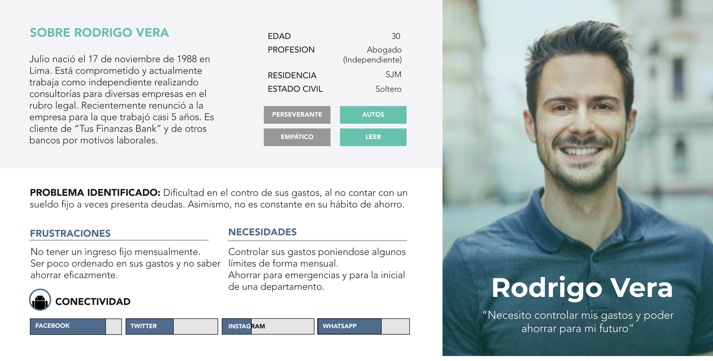

# Aplicación financiera

## Índice

* [Contexto](#contexto)
* [Objetivos del proyecto](#objetivos-del-proyecto)
* [Problemas encontrados](#problemas-encontrados)
* [Recomendaciones](#recomendaciones)
* [Link de Zeplin](#link-de-Zeplin)
* [Video Loom explicativo](#video-Loom-explicativo)

## Preámbulo

El banco más importante del país ha lanzado una nueva aplicación móvil al mercado para que sus usuarios puedan visualizar sus gastos mensuales y fomentar el ahorro. Luego de tener algunos meses en el mercado y algo de tracción, el equipo detrás de este nuevo producto ha decidido contratar a una agencia/consultora de UX que los ayude a definir la dirección y evolución del producto. Tú y otra compañera de Laboratoria trabajan en la agencia/consultora de UX y son asignadas al proyecto.

## Contexto

El papel del desarrollo tecnológico en la industria financiera ya es un imperativo, una necesidad casi inherente de las entidades bancarias. En la actualidad es impensable contratar un servicio o producto bancario sin tener a disposición la opción de realizar transacciones o consultas a través de una banca celular, página web o aplicativo móvil. El proceso de transformación tecnológica e innovación digital de servicios financieros ha estado liderado por EEUU y Europa. En el 2018 el banco BBVA (España) fue reconocido por segundo año consecutivo como la entidad con la mejor aplicación móvil de banca a nivel mundial,  por encima de Garanti (Turquía) y de un total de 42 bancos de 11 países (Forrester, 2018). 

A nivel de Latinoamérica, países como Brasil, México y Argentina constituyen los principales mercados que cuentan con aplicaciones de un alcance importante entre sus usuarios. En el año 2014, Technisys y la Universidad de Stanford realizaron un estudio en América Latina  donde el 90% de los bancos indicó que la razón por la que alcanzaron su capacidad digital fue para continuar siendo competitivos y adquirir clientes jóvenes; por otro lado, en pensando en los próximos 5 años, el 72% refirió que piensa que sus clientes no requerirán tener que ir personalmente a las sucursales.

Con respecto a la conducta de ahorro, control de gastos y otros hábitos gestión financiera, un estudio de Mercawise a nivel de México determinó que el 45% de los encuestados ahorra a través de una entidad bancaria; además, indicó que solo un 8.5% conocía planes de ahorro, mientras que a un 47.5% le gustaría comenzar un plan de ahorro con alguna compañía que se acople a tus necesidades. 

En el Perú, según el Departamento de Estudios Económicos de Scotiabank, el ahorro de las personas continuó en aumento durante los primeros meses del 2018, pasando a un ritmo de 10% a 14% en comparación del 2017; lo que indica una tendencia al crecimiento de esta conducta y que puede explicarse a causa de la Ley 95,5%, que permitió a las personas que acceden a la jubilación, disponer de hasta el 95.5% de sus fondos de pensiones. En este mismo estudio, se extrae que las personas mantuvieron su preferencia por ahorrar en moneda nacional.

De esta manera, teniendo en cuenta el crecimiento de las prácticas de ahorro y la transformación digital del rubro financiero, existe una gran oportunidad para introducir productos digitales prestos a atender necesidades financieras y potenciar las soluciones de banca ya existentes.

### Introducción

"Tus finanzas" es una aplicación móvil que permite a sus usuarios y usuarias tener un mejor control de su dinero y fomenta el hábito del ahorro, a través de funciones como: Mirar en detalle de sus transacciones (dónde y qué se gastó), crear metas de ahorros y administrar sus gastos (mirar gastos por categorías). Fue lanzada al mercado de forma independiente a la aplicación genérica del banco pero mantiene la conexión con esta para permitir a los usuarios y usuarias de la entidad acceder a la información de sus cuentas y créditos de forma fácil y rápida. Durante los 6 meses de vida de la aplicación, su principal fuente de publicidad ha sido Facebook Ads, observándose una buena respuesta por parte del público. Esto a pesar que uno de los obstáculos principales de la aplicación es que solo se encuentra disponible para el sistema operatido iOS, limitando de esta forma su alcance por la cantidad de usuarios de otros sistemas operativos como Android, que en Latinoamérica tiene una presencia más que importante. "Tus finanzas", busca convertirse en la primera aplicación bancaria en incluir estas características propias de aplicaciones no conectadas a una institución financiera o similar, para esto la empresa requiere tener mejor definidos a sus usuarios o usuarias, un adecuado user flow e integrar mejoras que respondan a las necesidades reportadas por estos usuarios.

### MVP inicial

### Landing Page incial del producto

[Ir a la web](http://tus-finanzas.pagedemo.co/)

### Objetivos del proyecto
* Realizar una propuesta de rediseño de app con un flujo centrado en el usuario.

* Brindar recomendaciones de presupuesto y pasos a seguir para el desarrollo de las soluciones ideales.

* Identificar, entender y validar los objetivos de negocio y stakeholders de la empresa y considerarlo en las etapas del desarrollo del producto.

* Profundizar nuestra capacidad de análisis de data.

### Presupuesto

|Actividad|Descripción|Puntos|
|:----|:---|:---:|
|Entendimiento del problema, la industria y el contexto| Entender el contexto del negocio y lo que existe hoy en día respecto de la industria del proyecto. | 15 |
|Entrevistas con cliente|Realización de entrevistas con el cliente (dueño del reto) y establecimiento de sus metas y objetivos.|25|
|Benchmark| Revisión de features de la competencia y referencias análogas. | 20 |
|Entrevistas con usuarios| Entrevistas en profundidad con al menos 5 usuarios. | 60 |
|Testeos de prototipos| Sesiones de testing de la solución propuesta (baja, media y alta fidelidad) con al menos 5 usuarios por sesión. | 60 |
|Sketching y wireframing| Elaboración de prototipos de baja y mediana fidelidad. | 30 |
|Prototipado de alta fidelidad| Elaboración de prototipo en base a las pantallas diseñadas. | 80 |
|| **TOTAL** | **290** |

## Investigación 

### Objetivo de negocio
- Posicionarse como un banco que brinde una herramienta adicional a sus clientes a fomentar una cultura de ahorro y les ayude a llevar el control de sus gastos.

### Conclusiones de la entrevista con cliente

Lee la [guía de entrevista al cliente](https://docs.google.com/document/d/1VUvD8Yw6R2EJ2qWMEscQPdg5pxXAbjsr2EWh6eUoSAU/edit)

### Conclusiones de la entrevista con usuarios

Lee la [guía de entrevista a usuario](https://docs.google.com/document/d/1fTS_hoWUfdpMc2ZxPnVSnDmG0xi_2y-Y3gRTQx5zIqw/edit?usp=drive_web&ouid=109584484767286568068)

### Recursos
Recursos entregados por nuestros clientes:

* User persona primario y secundario del proyecto
* User flows iniciales y actuales del proyecto del MVP
* Diseño del app en Figma , con una guía de componentes y el Prototipo navegable
* Funnel Analytics de los primeros 6 meses del MVP
* Data de uso del MVP de los primeros 6 meses
* Landing Page inicial del producto

## Síntesis y definición

### Affinity Diagram

### Insights principales del cliente

### Insights principales de la entrevista con usuarios

### Conclusiones del Affinity Map

Mira nuestro [Affinity Map online]()

### User Persona

### Customer Journey Map

En base a los recursos brindados y con ayuda del Customer Journey Map, realizamos el análisis e indetificamos los siguientes problemas:

### Problemas a nivel de negocio

### Problemas a nivel de usuario

### Problem Statements
* Toñita Savings necesita una manera rápida y segura de ingresar a la app financiera sin que le pidan sus credenciales cada vez que quiere revisar sus cuentas.

* Toñita Savings necesita recibir recordatorios o notificaciones de su app cuando esté sobrepasando sus gastos, cuando haya alcanzado un hito en su meta de ahorro.

* Toñita Savings necesita desarrollar el hábito de ahorrar teniendo opciones que se ajusten a la cantidad de dinero que gana y metas pequeñas o a corto plazo.

* Toñita Savings necesita acceder a un producto bancario que le permita guardar sus ahorros y separarlos del resto de dinero del cual dispone.

* Toñita Savings necesita comunicarse con su banco para resolver dudas sin tener que realizar una llamada o visitar las oficinas de forma física.

* Julio Aguinaldo necesita recibir notificaciones de sus fechas de depósito a su cuenta ahorro, para autorizar el débito del monto programado.

### HMW

* HMW generar en nuestros usuarios una sensación de seguridad al realizar operaciones en la aplicación?

### What if 

* What if los clientes pueden utilizar la app para gestionar sus ahorros independientemente del banco al que pertenezcan.

* What if Tus finanzas está integrada en la app nativa del banco.

* What if integramos un chatbot en la aplicación.

* What if la aplicación también está disponible para Android.

* What if integramos límites de gastos en la aplicación.

* What if cada vez que el usuario cumple un hito de ahorro, recibe una felicitación en su app que le indica que sube de nivel y gana una categoría.

* What if lo hacemos como un juego?

* What if si existen couch de ahorro personalizados o por temáticas (ejemplo: star wars, pokemon, avengers, etc.)

* What if le brindamos a nuestros usuarios la posibilidad de elegir un avatar y un nickname.

* What if si para ingresar a la app solo basta con la identificación por huella o patrón de seguridad.

## Planeamiento y validación de la solución

* ¿Quiénes son los principales usuarios de producto?
* ¿Cuáles son los objetivos del negocio en relación con el producto?
* ¿Cuáles son los objetivos de estos usuarios en relación con el producto?
* ¿Cuál será la propuesta de valor del sitio que vas a crear?
* ¿Cuáles son los contenidos que el usuario quiere ver, la información que buscarían para convencerse de confiar en la empresa que lo ofrece, encontrar lo que busca?
* ¿Cómo crees que el producto les está resolviendo sus problemas?

## Ideación

### Benchmark

### User Flow

## Prototipos

## Testing

### Testing del prototipo inicial: 
Decidimos testear el prototipo actual con una cantidad de 15 usuarios con el fin de obtener los primeros problemas, conocer cómo interactuan con las distintas funcionalidades que ofrece la app. Para este fin utilizamos como herramienta Maze.

Propusimos que desarrollen las funciones principales a través de tareas y encontramos los siguientes resultados:

### Conclusiones principales del primer testing al producto inicial:

* Notamos que existe confusión en la vista de ahorros, realizar una meta de ahorro está escrito como “Crear cuenta”.

* Proceso largo para registrarse. 4 de las personas testeadas desertaron en el proceso de registro.

* Usuarios no encuentran opción de volver al home cuando están en otra sección como ahorros, movimientos o gastos.

* Los usuarios pierden el menú circular flotante al momento de realizar scroll en la app.

* Huella digital: Los usuarios testeados en Android, indican que su celular no cuenta con esa opción.

* Movimientos: los usuarios no observan el origen de la operación, comprenden detalles pero sienten la información desordenada e incompleta.

* No se cuenta con la opción de cerrar sesión.

Puedes revisar el reporte y detalle del testing inicial en Maze [aquí.](https://maze.design/r/46woy8ffjse4laiu)

## Recomendaciones

### Modificaciones
### Próximos desarrollos
### Presupuesto de Marketing

## Entregables

## Video de Loom

## Zeplin

## Hacker edition
Antes de empezar a desarrollar este proyecto, lista cuáles fueron tus aprendizajes durante el proyecto 1 y en qué cosas te gustaría mejorar durante el proyecto 2. Al terminar el proyecto 2 vuelve a esta lista y chequea cómo te fue con esos retos, ¿los cumpliste? Muestrános esta lista y esta reflexión en un documento adicional (en el formato que prefieras). 

Mira nuestros compromisos en este [documento adicional]().

## Documentación
Puedes revisar la documentación de este proyecto en [Google Drive](https://drive.google.com/drive/folders/1ueIXQAb0uIvFChjjfdHhN-ItTmbN5psJ).

